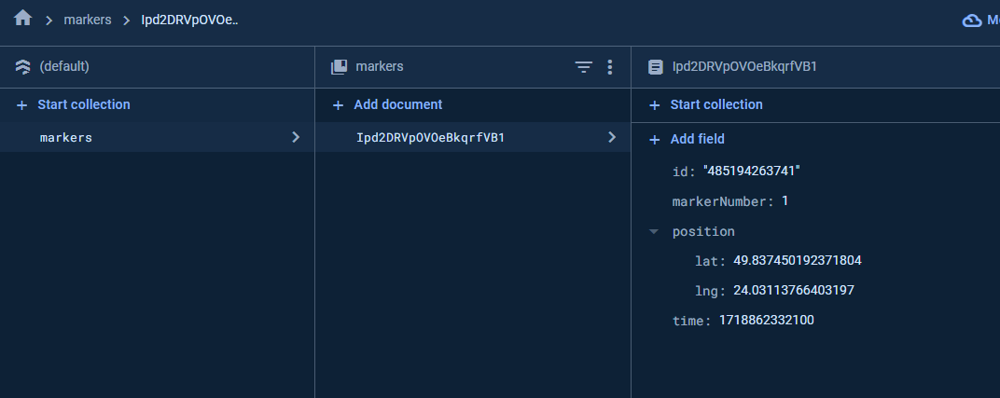

 # Map Test Task

    Implemented with React, Typescript and Firebase

    Link to Deployed Version: 
    - [DEMO LINK](https://map-test-task-gggd1uh1b-vlads-projects-8685c474.vercel.app/)

    Run `npm run dev` to run project on the localhost

    Run `npm run build` to build project

    Image of data structure on Firebase collection
    

    Additionally i can invite you as a member to project on firebase, to let you see how it works when someone use application, just send me e-mail.
